## Шаг 1. Добавить ссылки с github

После установки HAPP необходимо добавить ссылки с github.

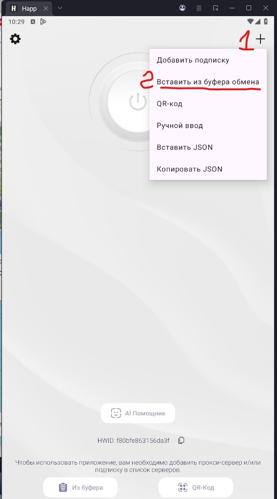

Ссылки:

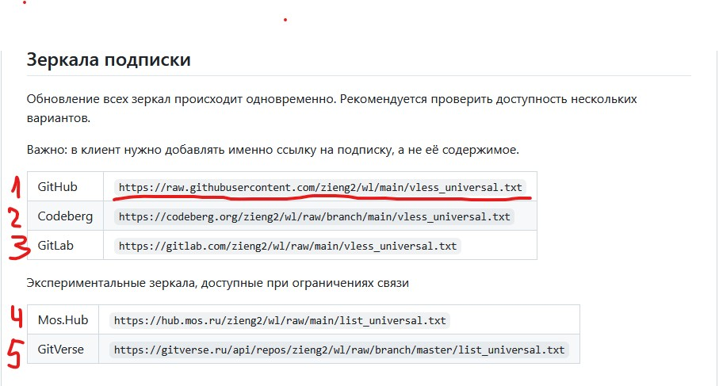

## Шаг 2. Должно получиться

Должно получиться следующее:

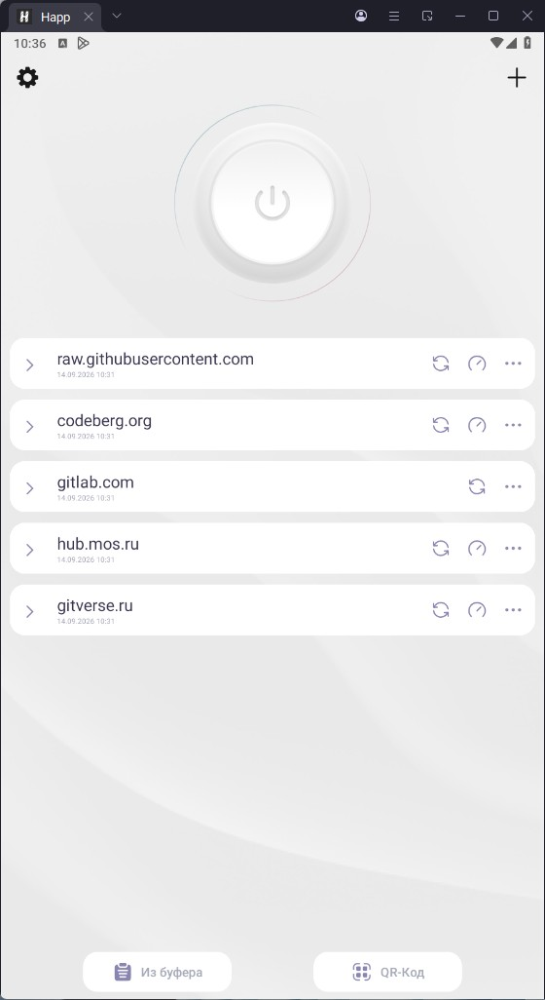

## Шаг 3. Идем в настройки

Далее идем в настройки, нажимаем "шестеренку".

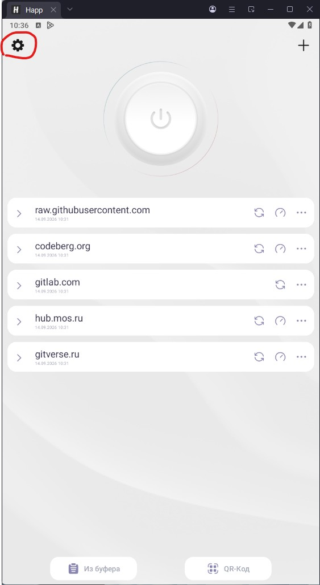

Заходим в "Подписки" и в самом низу отмечаем "Сортировать по пингу".

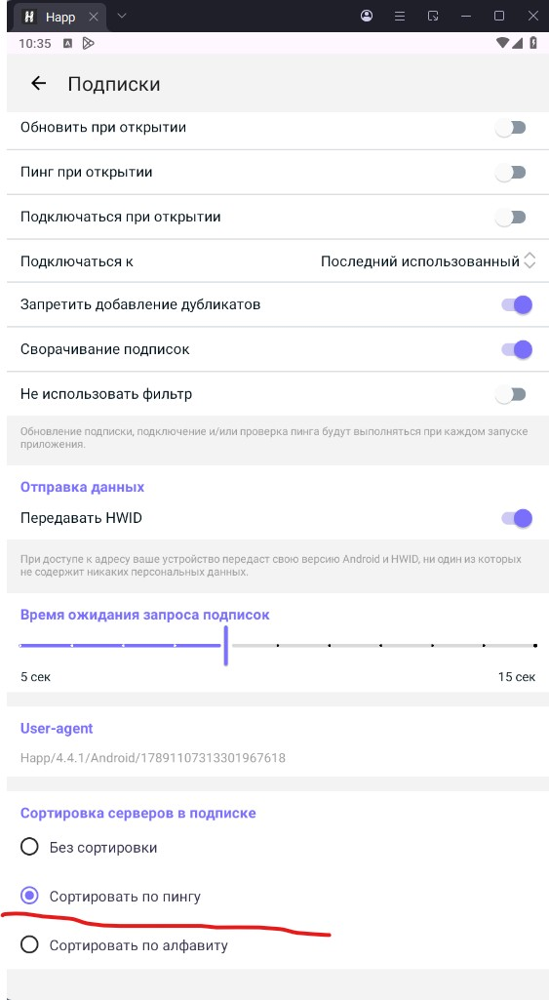

## Шаг 4. Обновляем подписки

Возвращаемся в главное окно HAPP и напротив каждой подписки нажимаем "стрелочки".

Лучше обновляться по WiFi. Чем чаще будете обновляться, тем актуальнее будет список доступных VPN-серверов. Списки обновляются каждый час.

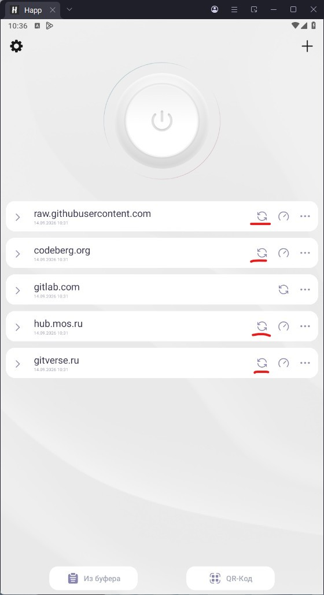

## Шаг 5. Проверяем доступность серверов

Напротив любой из подписок нажимаем "кружок со стрелочкой".

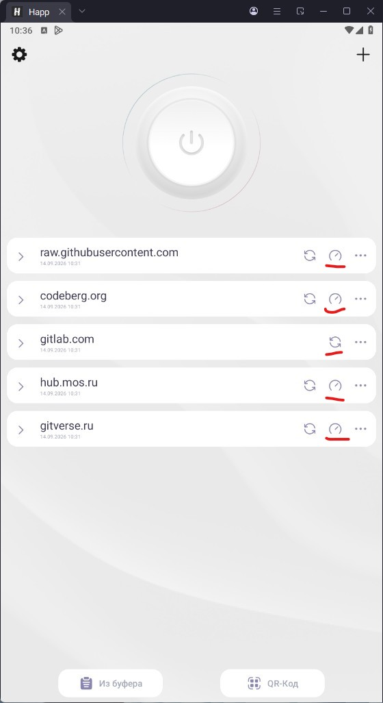

Ждем примерно минуту-две (зависит от интернет-соединения), открываем подписку. Там появится список доступных серверов.

Цифры напротив серверов показывают время отклика сервера. Чем меньше цифра, тем выше скорость соединения.

И подключаемся к серверу, выбрав его нажатием.

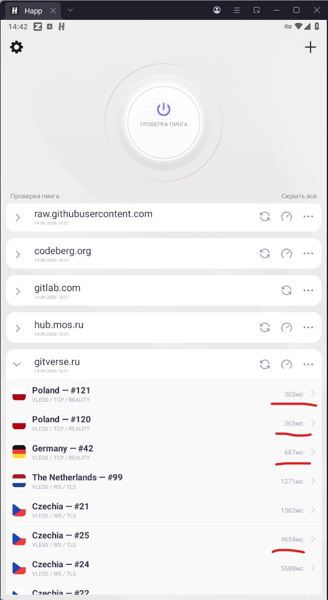

Далее проверяем работу VPN-соединения (нажимаем "Проверить текущее подключение").

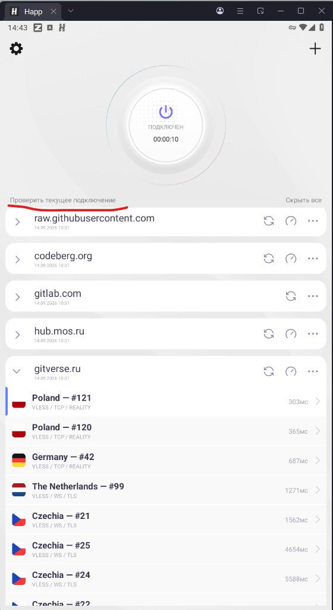

Если всё хорошо, то видим отклик от сервера в миллисекундах.

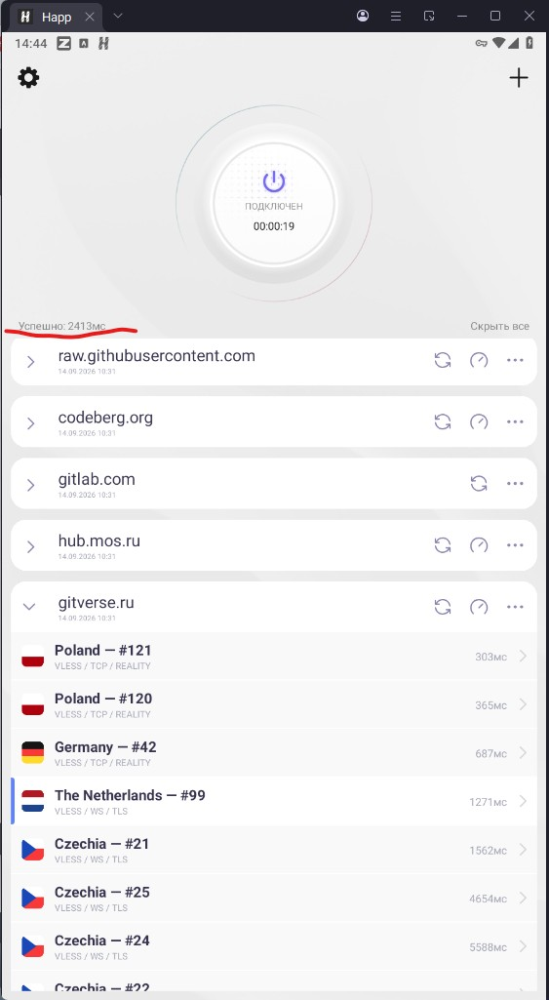

Можно пользоваться интернетом. Если же там что-то другое написано, значит VPN-туннель не работает и нужно подключаться к другому серверу.

## Шаг 6. Не забываем отключать соединение

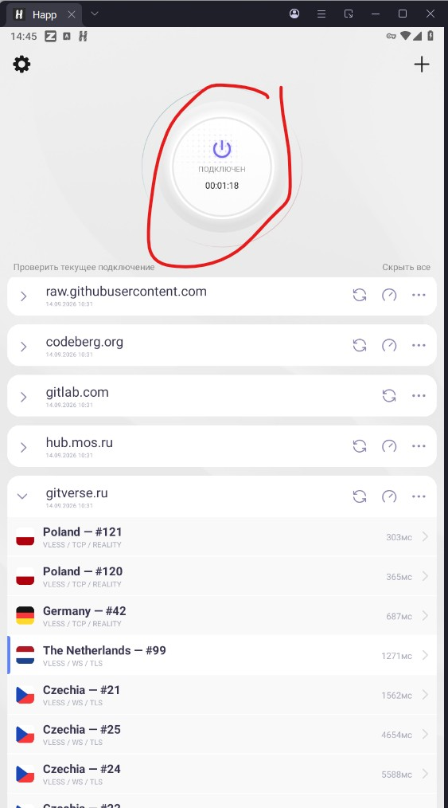

Не забываем отключать соединение, чтобы остальные ресурсы (банки, маркетплейсы и т.д.) были доступны.

P. S.

Последние две подписки работают и в мобильных сетях.

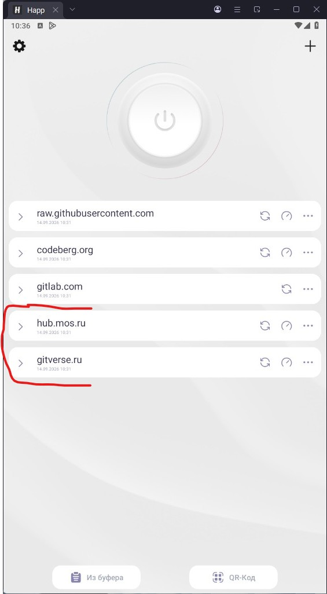
